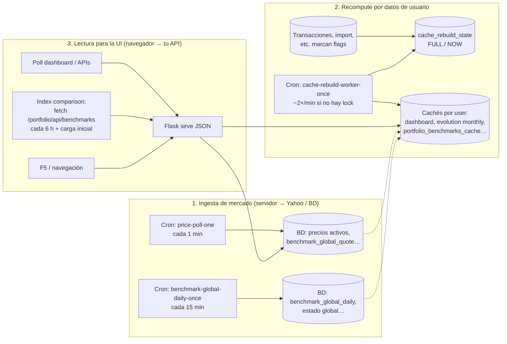

# Arquitectura: crons, cachés y UI (visión por capas)

## Diagrama (3 columnas)

## Tabla rápida: qué va en cada columna

| Elemento | Columna | Rol breve |
|----------|---------|-----------|
| `install_price_poll_cron.sh` → `price-poll-one` | **1** | Un slot/min: actualiza un activo o un índice en BD (Yahoo desde servidor). |
| `install_benchmark_global_cron.sh` → `benchmark-global-daily-once` | **1** | Mantiene series **diarias globales** de índices en BD. |
| `install_cache_rebuild_cron.sh` → `cache-rebuild-worker-once` | **2** | Si hay usuario pendiente en `cache_rebuild_state`, reconstruye sus cachés (incl. comparación índices). |
| Marcas FULL/NOW (transacciones, etc.) | **2** | Encolan trabajo; el worker lo consume. |
| `fetch /portfolio/api/benchmarks` (JS, 6 h) | **3** | Solo **lee** comparación ya calculada / actualizada en servidor. |
| Dashboard / otras APIs con poll | **3** | Igual: lectura de estado en servidor. |

## Relación entre columnas (una frase)

**1** llena y mantiene **BD de mercado**; **2** recalcula **cachés por usuario** cuando cambian **tus** datos o cuando el worker dispara rutas que también refrescan benchmarks; **3** solo **pregunta** al servidor y pinta; **no** llama a Yahoo.

