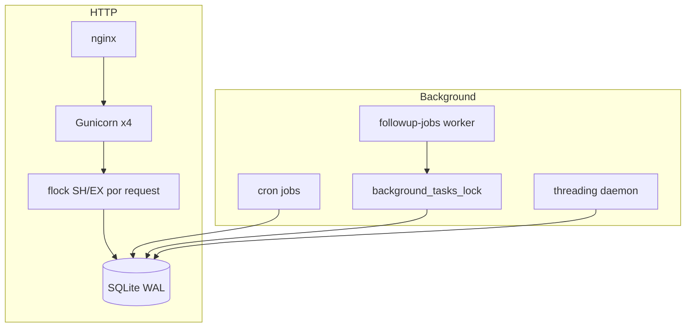

# Arquitectura: jobs, procesos y concurrencia

Referencia para desarrollo y operación en la VM GCP (`followup`).

## Procesos en producción

| Proceso | Tecnología | Rol |
|---------|------------|-----|
| Web | **Gunicorn** (4 workers) | Peticiones HTTP Flask |
| Jobs largos | **systemd** `followup-jobs.service` | Cola FIFO en BD (`company_reports`) |
| Programados | **cron** (usuario `followup`) | Precios, cachés, benchmarks, macro |
| Proxy | **nginx** | HTTPS → `:5000` |

No hay Celery, Redis ni cola externa.

## Crons (inventario)

Ver `scripts/README_CRONS.md`. Resumen:

| Frecuencia | Comando |
|------------|---------|
| Cada minuto | `flask price-poll-one` |
| Cada minuto (:00, :30) | `flask cache-rebuild-worker-once` |
| Cada 15 min | `flask benchmark-global-daily-once` |
| 00:00 UTC | `flask analyst-consensus-refresh-stale` |
| 22:35 Madrid (TZ en línea cron) | `flask global-strategy-macro-daily-once` |
| 07:00 UTC | `refresh_interest_rate_context_snapshot.py` |

Cada cron usa **`flock -n`** en `instance/*.flock`: si el job anterior sigue corriendo, ese tick se omite (no encola).

## Hilos Python (solo tareas cortas)

`threading.Thread` (daemon) en el worker Gunicorn que atendió la petición:

- Actualización manual de precios (`portfolio/prices.py`)
- Progreso de import CSV (lectura vía archivo compartido)
- Recuperación legacy de informes (preferir `followup-jobs`)

**Regla:** trabajos >30 s → cola BD + `followup-jobs`, no hilos nuevos.

## SQLite: coordinación entre procesos

La BD de producción es **SQLite** (`instance/followup.db`) con:

- `PRAGMA journal_mode=WAL`
- `PRAGMA busy_timeout=60000`
- `NullPool` (cierra conexión al devolverla)

### Locks

| Mecanismo | Fichero / ubicación | Uso |
|-----------|---------------------|-----|
| `sqlite_cross_process_lock` | `instance/followup.db.advisory.flock` | GET=SH, POST/PUT/PATCH/DELETE=EX entre Gunicorn y cron |
| `background_tasks_lock` | `instance/followup.background_tasks.lock` | Informes IA / entrega (fair queue por `report_id`) |
| Cron `flock` | `instance/*.cron.flock` | Evitar solapamiento del mismo job |

### Reglas críticas (evitar bloqueos)

1. **No** envolver llamadas HTTP externas (Yahoo, Gemini) con `exclusive_db_lock` global.
2. Endpoints de **solo progreso** (`import_progress`, `price_update_progress`) están excluidos del flock EX en POST largos.
3. En tests (`TESTING=True`) el flock por petición está desactivado.

## Diagrama

## Arranque tras reinicio VM

Servicios `enabled`: `followup`, `followup-jobs`, `nginx`, `cron`. No hay PostgreSQL ni Redis que levantar a mano.

Al arrancar Flask, `create_app` ejecuta recuperación de informes atascados (`company_report_recovery`).

## Relacionado

- `docs/ARQUITECTURA_CRONS_CACHE_UI.md` — capas ingestión / caché / UI
- `scripts/README_CRONS.md` — instalación de crons
- `GEMINI_IA.md` — pipeline informes Deep Research
