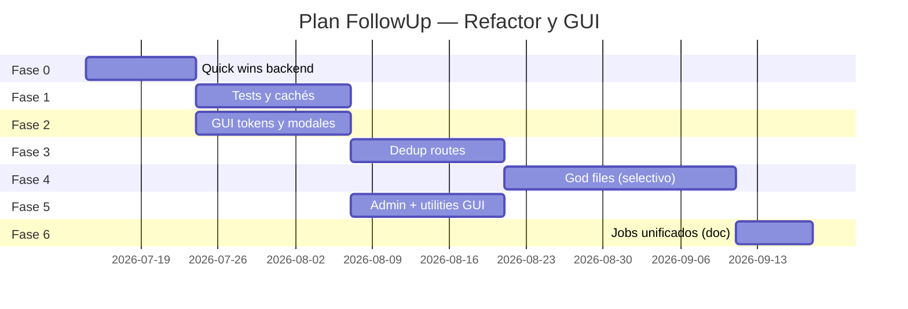

# Plan de refactorización, limpieza y homogeneización GUI — FollowUp

**Fecha:** Julio 2026  
**Alcance:** Mantenibilidad backend, tests, cachés, jobs y consistencia visual  
**Contexto:** Análisis de salud técnica (Jul 2026). La app funciona en producción; el plan prioriza **riesgo bajo primero**, refactors grandes solo con red de seguridad.

**Documento guía de diseño (canónico):** `docs/GUIA_REDISENO_PESTANAS.md`  
**Deprecar para UI:** secciones de paleta/componentes en `DESIGN_SYSTEM.md` que contradigan Palette B.

---

## Objetivos

| # | Objetivo | Métrica de éxito |
|---|----------|------------------|
| O1 | Reducir deuda y confusión en el repo | 0 scripts `test_*`/`debug_*` en `app/services/` |
| O2 | Menos regresiones en deploy | ≥15 smoke/integration tests en CI o pre-deploy |
| O3 | Cachés coherentes tras mutaciones | Una API de invalidación usada en todas las rutas de escritura |
| O4 | GUI homogénea | Admin y utilidades portfolio alineadas con Palette B |
| O5 | Arquitectura de jobs más simple | Sin nuevos `threading.Thread` para trabajos >30 s |

---

## Principios de ejecución

1. **Una fase a la vez** — no mezclar limpieza masiva con refactors de negocio.
2. **Cada tarea tiene PR/commit desplegable** — compatible con `ui/dashboard-layout-experiments` + `deploy-experimental-branch.sh`.
3. **Tests antes de god-file splits** — no partir `gemini_service` / `net_worth_service` sin smoke tests.
4. **No reescritura** — extraer y consolidar, no cambiar stack (Flask + Jinja + Alpine).

---

## Vista general (12 semanas)



*Fases 2 y 3 pueden solaparse si hay dos personas; en solitario: F0 → F1 → F2 → F3 → F4 → F5.*

---

## Fase 0 — Quick wins (1–2 semanas)

**Riesgo:** bajo | **Impacto:** alto en claridad

### 0.1 Relocalizar scripts de `app/services/` ✅ (Jul 2026)

| Tarea | Detalle |
|-------|---------|
| Movidos | **78** scripts → `scripts/archive/app_services_legacy/` |
| Verificado | Cero imports en `app/`, `tests/`, crons o workers |
| README | `scripts/archive/app_services_legacy/README.md` |

### 0.2 Eliminar código muerto ✅ (Jul 2026)

| Artefacto | Acción |
|-----------|--------|
| `app/services/importer.py` | Eliminado (sustituto: `importer_v2`) |
| `app/templates/portfolio/dashboard_new.html` | Eliminado |
| `app/templates/portfolio/dashboard_old_backup.html` | Eliminado |
| `app/services/update_prices.py` | Movido a archive (sustituto: cron `price-poll-one` / `PriceUpdater`) |

**Aceptación:** `create_app` OK; `pytest tests/` verde.

### 0.3 Documentar concurrencia

| Tarea | Archivo nuevo |
|-------|----------------|
| Diagrama Gunicorn + cron + worker + flock | `docs/ARQUITECTURA_JOBS_Y_CONCURRENCIA.md` |
| Reglas: no lock global durante I/O HTTP | Incluir en el mismo doc |

### 0.4 Deprecar diseño obsoleto

| Tarea | Detalle |
|-------|---------|
| Banner en `DESIGN_SYSTEM.md` | “Paleta y componentes → ver `GUIA_REDISENO_PESTANAS.md`” |
| Enlace desde README | Una línea apuntando a la guía canónica |

**Entregable Fase 0:** repo más limpio, documentación de jobs, sin cambio de comportamiento visible.

---

## Fase 1 — Tests y cachés (2 semanas)

**Riesgo:** bajo–medio | **Impacto:** confianza en deploys

### 1.1 Infraestructura de tests

| Tarea | Detalle |
|-------|---------|
| `tests/conftest.py` | Fixture app + BD SQLite en memoria o tmp |
| Helper auth | `login_as(client, user)` para rutas protegidas |
| `pytest.ini` | Marcadores `smoke`, `integration` |

### 1.2 Smoke tests mínimos (objetivo: 15)

| # | Test | Ruta / flujo |
|---|------|----------------|
| 1 | Login OK | `/auth/login` |
| 2 | Dashboard 200 autenticado | `/dashboard` |
| 3 | Portfolio dashboard | `/portfolio/dashboard` |
| 4 | Import CSV fixture pequeño IBKR | `/portfolio/import/process` |
| 5 | Crear transacción manual | API o form |
| 6 | Gastos list 200 | `/expenses` |
| 7 | Ingresos list 200 | `/incomes` |
| 8 | Invalidación caché tras import | Assert flag o versión |
| 9 | Watchlist API | GET watchlist items |
| 10 | `price-poll-one` CLI no crash | subprocess / cli runner |
| 11 | `cache-rebuild-worker-once` idle | cli runner |
| 12 | Global strategy math (ya existe) | mantener |
| 13 | Valuation modes (ya existe) | mantener |
| 14 | CSRF en POST mutación | 400 sin token |
| 15 | Admin requiere admin | 403 usuario normal |

**Aceptación:** `pytest tests/` verde en local; opcional hook pre-deploy.

### 1.3 API unificada de invalidación de caché

```python
# app/services/cache_invalidation.py (nuevo)
def invalidate_user_data_caches(user_id, *, dates=None, full_history=False):
    """Única entrada tras mutaciones de cartera, import, transacciones."""
```

| Migrar rutas | Prioridad |
|--------------|-----------|
| `import_routes.py`, `transactions.py` | Alta |
| `crypto.py`, `metales.py`, `accounts.py` | Alta |
| `real_estate.py`, `debts.py` | Media |

**Aceptación:** grep confirma que rutas de escritura llaman al helper; test 1.2 #8 pasa.

**Entregable Fase 1:** red de seguridad básica + menos bugs de datos stale.

---

## Fase 2 — GUI: tokens y modales (2 semanas)

**Riesgo:** bajo (CSS) | **Impacto:** base para toda homogeneización

### 2.1 Hoja de estilos compartida

**Archivo:** `app/static/css/followup-ui.css`

| Clase | Sustituye |
|-------|-----------|
| `.followup-card` | `debt-card`, `bank-card`, `expense-card`, `income-card`, `portfolio-card`, `sp-plan-card`, `dashboard-card`, `pf-card` (gradual) |
| `.followup-thead` | `tx-thead`, `map-thead`, `watchlist-thead`, … |
| `.followup-touch-btn` | `*-touch-btn` duplicados |
| `.followup-title` | Patrón emoji + título |
| `.followup-modal-surface` | Ya en `layout.html` — usar en todos los modales |

**Incluir en** `base/layout.html` vía `<link>`.

### 2.2 Piloto de migración (2 pantallas)

1. `debts/dashboard.html` — referencia finance  
2. `portfolio/transactions.html` — utilidad portfolio  

**Aceptación:** sin regresión visual; checklist guía § checklist unificada.

### 2.3 Componentes modales

| Archivo | Uso |
|---------|-----|
| `components/modal_confirm.html` | Sustituir `confirm()` |
| `components/modal_alert.html` | Sustituir `alert()` |

**Migrar primero (8 archivos con alert/confirm):**

- `portfolio/import_csv.html`
- `portfolio/transaction_form.html`
- `portfolio/asset_registry.html`
- `portfolio/asset_detail.html`
- `auth/profile.html`
- `expenses/categories.html`
- `real_estate/detail.html`
- `admin/cache.html`

**Entregable Fase 2:** CSS compartido + modales estándar en flujos críticos.

---

## Fase 3 — Deduplicación de rutas (2 semanas)

**Riesgo:** medio | **Requisito:** Fase 1 tests

### 3.1 Gastos ↔ Ingresos

| Extraer | Ubicación |
|---------|-----------|
| Helpers recurrencia compartidos | `app/utils/recurrence_route_helpers.py` o `app/routes/_recurrence_shared.py` |
| Patrón categorías CRUD | Funciones parametrizadas por modelo |

**Meta:** reducir ~300 LOC duplicadas.

### 3.2 Crypto ↔ Metales

| Extraer | Detalle |
|---------|---------|
| `manual_asset_dashboard_routes(asset_type, metrics_service, template_prefix)` | Factory o blueprint helper |

### 3.3 FIFO único

| Extraer desde | A |
|---------------|---|
| `net_worth_service.py` (3 bloques) | `app/services/metrics/fifo_holdings.py` |
| Consumir desde | `portfolio_valuation`, `basic_metrics`, `importer_v2` |

**Aceptación:** tests de valoración existentes siguen verdes; un solo algoritmo documentado.

**Entregable Fase 3:** menos divergencia entre módulos gemelos.

---

## Fase 4 — God files (selectivo, 3 semanas)

**Riesgo:** alto | **Solo con Fase 1 completa**

### 4.1 `gemini_service.py` (2.269 LOC)

| Nuevo módulo | Responsabilidad |
|--------------|-----------------|
| `app/services/gemini/about.py` | Resumen About |
| `app/services/gemini/deep_research.py` | Interactions API, polling |
| `app/services/gemini/config.py` | Timeouts, modelos, env |
| `gemini_service.py` | Re-export backward compatible |

### 4.2 `net_worth_service.py` (2.174 LOC)

| Nuevo módulo | Responsabilidad |
|--------------|-----------------|
| `net_worth/stock.py`, `crypto.py`, `real_estate.py`, … | Por clase de activo |
| `net_worth/aggregator.py` | Orquestación dashboard patrimonio |

### 4.3 Rutas portfolio

| Archivo | Acción |
|---------|--------|
| `assets.py` | Mover lógica informes → `company_report_ui_service.py`; rutas <400 LOC |
| `watchlist.py` | APIs → `watchlist_api_service.py`; plantilla puede quedar grande |

**Regla:** cada PR ≤500 LOC de diff; re-export para no romper imports.

**Entregable Fase 4:** archivos críticos <800 LOC; imports estables.

---

## Fase 5 — GUI catch-up (2 semanas)

**Riesgo:** bajo | **Puede empezar tras Fase 2**

### 5.1 Admin (mayor outlier)

| Plantilla | Cambio |
|-----------|--------|
| `admin/index.html`, `users_list.html`, `cache.html`, `api_monitor.html`, `catalogs.html`, `system.html` | `followup-card`, tablas slate, acciones teal/sky/rose |

### 5.2 Portfolio utilities

| Plantilla | Cambio |
|-----------|--------|
| `accounts.html`, `mappings.html`, `asset_registry.html`, `import_csv.html`, `data_export_import.html` | Unificar modales a `.followup-modal-surface` |
| Añadir a guía | Sección “Pestañas ya tocadas” |

### 5.3 Deudas restructure

| Plantilla | Cambio |
|-----------|--------|
| `debts/restructure.html` | `debt-card` + formularios como `debts/form.html` |

### 5.4 Migración gradual de card aliases

Orden sugerido: banks → expenses/incomes → portfolio → spending_plan → dashboard.

**Aceptación:** checklist guía al 100% en módulos listados; admin indistinguible del resto en paleta.

**Entregable Fase 5:** producto visualmente coherente.

---

## Fase 6 — Jobs y arquitectura (1 semana, mostly doc + pequeños cambios)

**Riesgo:** medio | **No bloqueante para GUI**

### 6.1 Política de jobs (documentar y aplicar)

| Duración | Mecanismo permitido |
|----------|---------------------|
| <30 s, UI feedback | `threading` + archivo progreso (`_shared.py`) |
| 30 s – 45 min | Cola `company_reports` + `followup-jobs` |
| Programado | cron + `flock` |
| Nuevo trabajo largo | **Prohibido** nuevo thread daemon sin revisión |

### 6.2 Consolidar precios (opcional si hay tiempo)

| Unificar en | Modos |
|-------------|-------|
| `price_update_service.py` | `poll_one`, `batch_manual`, `watchlist_refresh` |

### 6.3 PostgreSQL (decisión, no implementación obligatoria)

| Criterio para migrar | Acción |
|----------------------|--------|
| Dominio estable + >1 usuario concurrente o locks frecuentes | Plan `docs/MIGRACION_POSTGRESQL.md` |
| Hasta entonces | Mantener SQLite + reglas flock |

**Entregable Fase 6:** reglas claras; menos patrones nuevos ad hoc.

---

## Backlog (después de 12 semanas)

| Item | Cuándo |
|------|--------|
| Tailwind CDN → build (`npm` + `output.css`) | Tras unificar clases en `followup-ui.css` |
| Extraer JS watchlist a módulos | Si molesta mantenimiento |
| `CompanyReportOrchestrator` único | Si siguen incidencias de informes atascados |
| Tests integración import IBKR+DeGiro completos | Cuando haya fixtures CSV en repo |
| i18n / accesibilidad | No prioritario hoy |

---

## Checklist por deploy (cada fase)

- [ ] `pytest` smoke verde
- [ ] Probar en local: login, dashboard, import, watchlist
- [ ] Commit + push rama experimental
- [ ] `./scripts/deploy-experimental-branch.sh`
- [ ] Verificar https://followup.fit (o IP si dominio en redención)
- [ ] `journalctl -u followup -n 50` sin errores nuevos

---

## Estimación de esfuerzo

| Fase | Días persona (estimado) | Acumulado |
|------|-------------------------|-----------|
| 0 Quick wins | 3–5 | 5 |
| 1 Tests + cachés | 8–10 | 15 |
| 2 GUI tokens | 8–10 | 25 |
| 3 Dedup rutas | 8–10 | 35 |
| 4 God files | 12–15 | 50 |
| 5 GUI catch-up | 8–10 | 60 |
| 6 Jobs doc | 3–5 | 65 |

*~3 meses a tiempo parcial (≈2–3 h/día) o ~6–7 semanas a tiempo completo.*

---

## Por dónde empezar mañana

1. **Fase 0.1** — mover scripts de `app/services/` (1 PR, cero riesgo).  
2. **Fase 0.2** — borrar muertos (1 PR).  
3. **Fase 1.2** — primeros 5 smoke tests (login, dashboard, portfolio).

Si solo puedes una cosa: **Fase 0 + smoke tests (Fase 1)** — máximo retorno con mínimo riesgo.

---

## Referencias

- `docs/GUIA_REDISENO_PESTANAS.md` — GUI canónica  
- `docs/ARQUITECTURA_CRONS_CACHE_UI.md` — capas ingestión / caché / UI  
- `scripts/README_CRONS.md` — inventario crons  
- `GEMINI_IA.md` — pipeline informes  
- Análisis Jul 2026 (chat) — origen de este plan  
